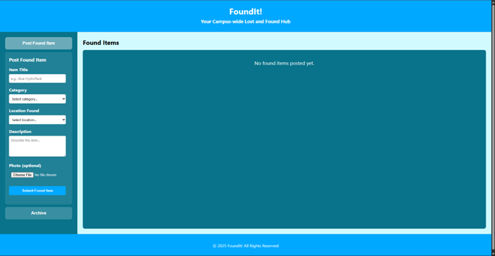
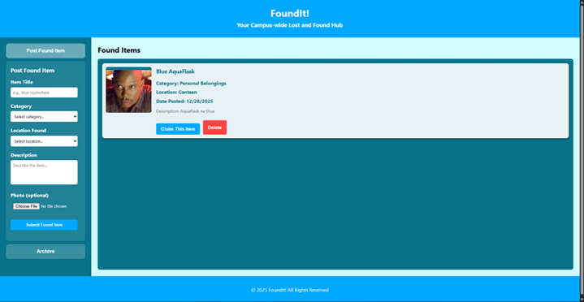
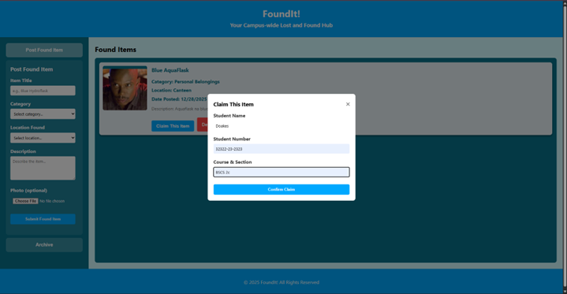
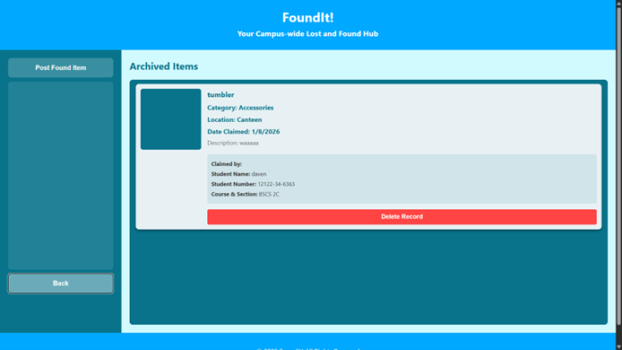

# FoundIt! : Your Campus-Wide Lost & Found
**A Campus-Based Lost and Found Management System** 

## Introduction
FoundIt! is a web-based system designed to centralize the process of posting and claiming found items on campus. It replaces disorganized manual methods with a digital database to ensure lost property is returned to rightful owners through "Active" and "Archive" listings.

### Technologies Used
* **Front-End:** HTML5, CSS3, Vanilla JavaScript
* **Back-End:** PHP, PDO (PHP Data Objects)
* **Database:** MySQL 
* **Tools:** XAMPP, phpMyAdmin, VS Code 

---

## Database Design
The schema uses a normalized 3-table structure (Categories, Items, and Claims) to ensure data integrity.

> **[PLACEHOLDER: Insert ER Diagram Image Here - Figure 1]**

### Relationships
* **Categories to Items:** One-to-Many; one category covers multiple items.
* **Items to Claims:** One-to-Zero-or-One; items stay 'active' until a single claim record is linked via a Unique Foreign Key.

---

## Web Interface & Functionalities
The system features a responsive GUI that adapts to both desktop and mobile views.

* **Posting Form:** Allows users to upload item titles, locations, descriptions, and photos.
* **Found Items Panel:** A real-time list fetching "active" items as cards.
* **Claim System:** A modal pop-up that captures claimant details and triggers a database transaction to archive the item.
* **Archive:** Stores the history of claimed items and claimant information.

> ****
> ****
> ****
> ****
> ****
> ****

---

## Challenges and Learning
* **Normalization:** Transitioning to a three-table model and managing Foreign Key constraints (like `ON DELETE CASCADE`) was a significant hurdle.
* **Pathing & Caching:** Debugging 404 errors for images taught me the nuances of absolute vs. relative paths in PHP.
* **Full-Stack Integration:** Gained insight into using JavaScript fetch requests to bridge the UI and MySQL via PHP.
* **UI/UX Precision:** Learned modern styling techniques like `object-fit: cover` to ensure consistent image rendering.
